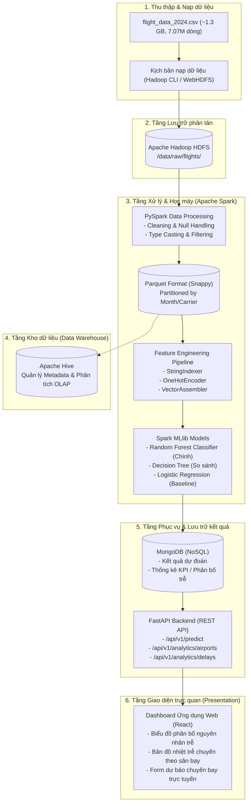

# KIẾN TRÚC HỆ THỐNG VÀ CÔNG NGHỆ (ARCHITECTURE & TECH STACK)

> Tài liệu này mô tả chi tiết kiến trúc phân tán toàn diện của hệ thống Big Data được đề xuất trong đồ án của Nhóm 6.

---

## 1. SƠ ĐỒ KIẾN TRÚC TỔNG THỂ (HIGH-LEVEL ARCHITECTURE)

---

## 2. CHI TIẾT CÁC THÀNH PHẦN CÔNG NGHỆ

### 2.1. Tầng Lưu trữ phân tán: Apache Hadoop HDFS
* **Mục tiêu:** Cung cấp cơ chế lưu trữ phân tán, chịu lỗi (fault-tolerant) với hệ số nhân bản (replication factor) phù hợp.
* **Cấu trúc lưu trữ dự kiến trên HDFS:**
  * `/data/raw/flights/2024/flight_data_2024.csv`: Dữ liệu thô ban đầu.
  * `/data/processed/flights/2024/`: Dữ liệu đã qua làm sạch lưu dưới định dạng Parquet.

### 2.2. Tầng Tính toán & Tiền xử lý: Apache Spark (PySpark)
* **Xử lý phân tán trên RAM (In-Memory Computing):**
  * Đọc dữ liệu phân tán thông qua Spark DataFrames.
  * Xử lý giá trị khuyết thiếu (Null Handling).
  * Chuyển đổi kiểu dữ liệu thời gian (`fl_date`, `crs_dep_time`,...).
  * **Tối ưu hóa:** Ghi ra định dạng **Apache Parquet** có nén **Snappy** và phân vùng (`partitionBy("month")`). Giúp giảm kích thước lưu trữ từ 1.3 GB xuống khoảng ~180 MB, tối ưu hóa I/O cho các truy vấn kế tiếp.

### 2.3. Tầng Học máy: Phân tầng Mô hình từ Nền tảng đến Cải tiến Tiên tiến
Hệ thống triển khai 2 nhóm mô hình để so sánh đối chứng toàn diện:

1. **Nhóm Mô hình Nền tảng (Baseline & Core):**
   * **Logistic Regression:** Mô hình tuyến tính làm chuẩn đối sánh tối thiểu (Baseline).
   * **Decision Tree:** Cây quyết định đơn lẻ để đánh giá độ phức tạp và nguy cơ Overfitting.
   * **Random Forest (Đề xuất chính trong đề tài):** Thuật toán Ensemble Bagging phân tán đa cây trên Apache Spark MLlib (`RandomForestClassifier`), đóng vai trò mô hình hạt nhân của đồ án.
2. **Nhóm Mô hình Cải tiến Tiên tiến (State-of-the-Art Gradient Boosting):**
   * **LightGBM (Light Gradient Boosted Machine - Microsoft):** Tối ưu hóa tốc độ và bộ nhớ bằng kỹ thuật GOSS & EFB, cực kỳ lý tưởng cho dữ liệu lớn hàng triệu dòng.
   * **CatBoost (Yandex):** Tối ưu hóa vượt trội cho các biến phân loại danh mục lớn (`op_unique_carrier`, `origin`, `dest`) mà không làm phình ma trận dữ liệu.
   * **XGBoost (eXtreme Gradient Boosting):** Mô hình Gradient Boosting kinh điển với khả năng kiểm soát điều chuẩn L1/L2 chống quá khớp.
* **Spark ML Pipeline chuẩn bị đặc trưng:**
   1. `StringIndexer`: Mã hóa các biến phân loại dạng chuỗi (`op_unique_carrier`, `origin`, `dest`).
   2. `OneHotEncoder`: Biến đổi sang vector thưa (áp dụng cho các mô hình không hỗ trợ trực tiếp categorical features).
   3. `VectorAssembler`: Kết hợp toàn bộ đặc trưng vào cột vector duy nhất `features`.
* **Tiêu chí đánh giá chất lượng:** Accuracy, Weighted Precision, Weighted Recall, F1-Score, Confusion Matrix và Thời gian thực thi (Training Time / Inference Time).

### 2.4. Tầng Kho dữ liệu: Apache Hive
* Định nghĩa External Table ánh xạ trực tiếp đến thư mục Parquet trên HDFS.
* Hỗ trợ các truy vấn phân tích tổng hợp (OLAP queries) bằng cú pháp HiveQL.

### 2.5. Tầng Dịch vụ & Cơ sở dữ liệu: MongoDB + FastAPI
* **MongoDB:** Lưu trữ các bảng tổng hợp chỉ số (Aggregate stats) và log dự đoán của mô hình.
* **FastAPI:** Khung ứng dụng Python tốc độ cao, hỗ trợ Swagger UI (`/docs`), cung cấp các endpoint phục vụ Client.

### 2.6. Tầng Trực quan hóa: React + Plotly / Chart.js
* Giao diện người dùng tương tác:
  * Trang tổng quan (Overview Analytics): Tỉ lệ chuyến bay hoãn, top sân bay và hãng bay trễ nhiều nhất.
  * Trang phân tích nguyên nhân (Delay Root Causes): Tỷ trọng thời tiết, hãng bay, không lưu NAS, trễ máy bay chặng trước.
  * Trang dự báo (Interactive Prediction): Nhập thông tin chuyến bay (ngày, giờ, hãng, sân bay đi/đến) và nhận kết quả dự báo thời gian trễ / nguy cơ trễ.
