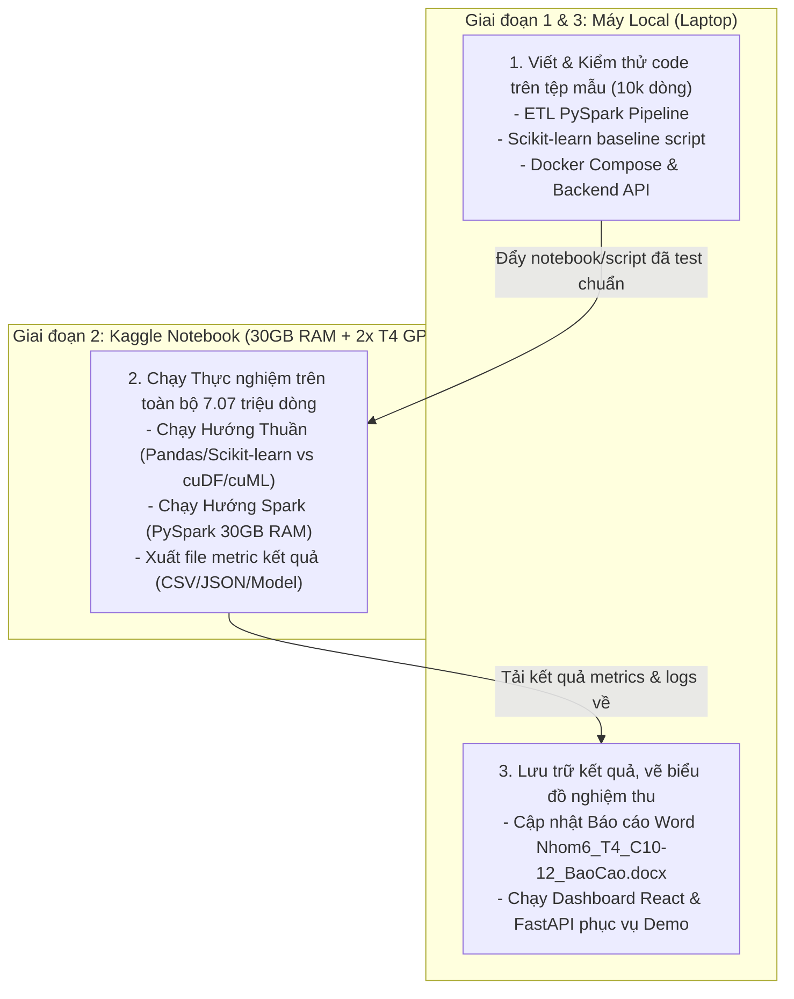

# THÔNG SỐ PHẦN CỨNG & CHIẾN LƯỢC MÔI TRƯỜNG THỰC NGHIỆM

> **Tài liệu xác thực thông số hệ thống thực tế (Ground Truth Hardware Specs)**  
> Dữ liệu được đo đạc trực tiếp từ hệ thống ngày `2026-09-16` qua lệnh PowerShell CIM và thư viện hệ thống.

---

## 1. THÔNG SỐ PHẦN CỨNG MÁY CỤC BỘ (LOCAL HOST MACHINE)

* **Thiết bị:** Máy tính xách tay cá nhân (Laptop) của sinh viên Lê Đức Lương.
* **Hệ điều hành:** Windows 11 Home/Pro (OS Build `10.0.26200`, 64-bit).
* **Bộ vi xử lý (CPU):**
  * Tên: **AMD Ryzen 7 250 w/ Radeon 780M Graphics**
  * Số nhân vật lý (Cores): **8 nhân**
  * Số luồng xử lý (Threads / Logical Processors): **16 luồng**
* **Bộ nhớ RAM:**
  * Tổng dung lượng vật lý: **15.31 GB (~16 GB)**
  * Dung lượng khả dụng thực tế khi chạy: **~4.20 GB - 5.50 GB** (Do hệ điều hành Windows và các tiến trình nền chiếm dụng ~10 - 11 GB).
  * **Cảnh báo Big Data:** Bộ nhớ khả dụng này **KHÔNG ĐỦ** để nạp trực tiếp toàn bộ 7.07 triệu dòng dữ liệu vào Pandas mà không bị tràn RAM (OOM).
* **Card đồ họa (GPU):**
  * GPU rời: **NVIDIA GeForce RTX 5050 Laptop GPU** (Hỗ trợ CUDA, Tensor Cores).
  * GPU tích hợp: AMD Radeon 780M Graphics.
* **Lưu trữ (Storage):**
  * Ổ đĩa `C:\`: Tổng dung lượng **474.72 GB**, Dung lượng còn trống **71.95 GB** (SSD NVMe tốc độ cao).
* **Môi trường phần mềm đã xác nhận:**
  * **Java Runtime:** OpenJDK version `17.0.19` (Đã cài đặt sẵn, đạt chuẩn chạy Apache Spark 3.5.x).
  * **Python:** Python `3.13.14` (64-bit).

---

## 2. THÔNG SỐ MÔI TRƯỜNG ĐÁM MÂY KAGGLE (KAGGLE NOTEBOOK ENVIRONMENT)

* **Chi phí:** Miễn phí (Free Tier).
* **Bộ vi xử lý (CPU):** 4 vCPUs (Intel Xeon / AMD EPYC ảo hóa).
* **Bộ nhớ RAM:** **30.0 GB RAM** (Gấp đôi dung lượng máy cục bộ, toàn bộ 30GB dành riêng cho notebook, không bị OS ngốn).
* **Card đồ họa (GPU):** **2x NVIDIA Tesla T4** (16 GB VRAM mỗi card $\to$ Tổng **32 GB VRAM**).
* **Lưu trữ tạm thời (Disk):** ~73.0 GB không gian làm việc.
* **Giới hạn (Constraints):**
  * Giới hạn sử dụng GPU: 30 giờ / tuần.
  * Timeout phiên làm việc: Tối đa 12 giờ chạy liên tục hoặc 40 phút ngắt kết nối nếu không tương tác.

---

## 3. BẢNG SO SÁNH & ĐÁNH GIÁ ĐỊNH HƯỚNG SỬ DỤNG

| Tiêu chí | Máy Local (Laptop cá nhân) | Kaggle Notebooks (2x Tesla T4) | Kết luận lựa chọn |
| :--- | :--- | :--- | :--- |
| **Dung lượng RAM** | 16 GB (khả dụng ~4.2 GB) | **30 GB** (khả dụng > 28 GB) | **Kaggle vượt trội hoàn toàn**: Đọc mượt mà 7.07 triệu dòng mà không lo sập máy. |
| **Xử lý CPU** | **AMD Ryzen 7 (8C/16T, xung cao)** | 4 vCPUs (chia sẻ tài nguyên) | **Local mạnh hơn**: Phù hợp chạy PySpark local simulation, code logic ETL. |
| **Tăng tốc GPU** | RTX 5050 Laptop GPU | **2x Tesla T4 (32 GB VRAM)** | **Kaggle vượt trội**: Đủ VRAM để chạy RAPIDS cuDF / cuML hoặc XGBoost GPU trên full tập dữ liệu. |
| **Tính tiện lợi & Ổn định** | Chạy offline, không bị timeout, kết nối trực tiếp với file báo cáo Word và code | Phải upload dữ liệu, bị giới hạn 30h GPU/tuần, dễ mất kết nối | **Local tối ưu cho phát triển (Dev) & Lưu trữ**. |

---

## 4. CHIẾN LƯỢC KẾT HỢP HYBRID (LAI) ĐỀ XUẤT

Để tối ưu hóa thời gian, không bị gián đoạn và đạt kết quả thực nghiệm hoàn hảo nhất cho đồ án:

1. **Phát triển và kiểm thử cục bộ (Local):** Viết code sạch, debug thuật toán trên file mẫu [`flight_data_2024_sample.csv`](file:///c:/LeDucLuong/HK%20VII/NhapMonBigData/DoAn/Flight%20Delay%20Dataset%20%E2%80%94%202024/flight_data_2024_sample.csv) (10,000 dòng). Đảm bảo code chạy không có lỗi cú pháp hay logic.
2. **Huấn luyện quy mô lớn (Kaggle Cloud):** Đưa code lên Kaggle Notebook, tận dụng **30 GB RAM** và **2x GPU T4** để huấn luyện trên trọn vẹn **7,079,081 dòng**. Không sợ bị sập máy hay đơ Windows.
3. **Thu thập kết quả về Local:** Tải các file trọng số mô hình đã huấn luyện, bảng thời gian chạy (Execution Time) và chỉ số đánh giá (Accuracy, F1, Confusion Matrix) về máy để nạp vào MongoDB, phục vụ FastAPI và đưa vào Báo cáo đồ án.
