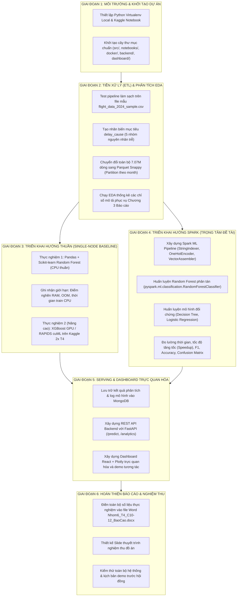

# KẾ HOẠCH HÀNH ĐỘNG TỔNG THỂ (MASTER EXECUTION PLAN)

> **Kế hoạch hành động toàn diện từ lúc mới tải dataset đến khi hoàn thành nghiệm thu đồ án.**  
> Áp dụng chiến lược đối chứng: **1 Hướng Thuần (Single-node Baseline) vs 1 Hướng Spark (Distributed Big Data)**.

---

## 1. BỨC TRANH TOÀN CẢNH: 6 GIAI ĐOẠN TRIỂN KHAI



---

## 2. CHI TIẾT CÁC BƯỚC HÀNH ĐỘNG CỤ THỂ

### GIAI ĐOẠN 1: Chuẩn bị Môi trường & Khung Thư mục (Tuần 1 - Tuần 2)
* [x] Đã tải bộ dữ liệu `Flight Delay Dataset — 2024` (7,079,081 dòng).
* [x] Đã khảo sát phần cứng máy tính và tài nguyên Kaggle.
* [x] Đã thiết lập hệ thống tài liệu chuẩn trong `doc/`.
* [ ] **Hành động tiếp theo 1.1:** Khởi tạo môi trường ảo Python `venv` trên máy cục bộ, cài đặt `pyspark`, `pandas`, `pyarrow`, `scikit-learn`, `fastapi`.
* [ ] **Hành động tiếp theo 1.2:** Tạo khung các thư mục dự án:
  ```text
  c:\LeDucLuong\HK VII\NhapMonBigData\DoAn\
  ├── src/
  │   ├── etl/         # Code xử lý dữ liệu PySpark & Pandas
  │   ├── baseline/    # Code mô hình hướng thuần
  │   ├── spark_ml/    # Code mô hình hướng Spark
  │   └── utils/
  ├── notebooks/       # Jupyter/Colab/Kaggle Notebooks
  ├── docker/          # Docker compose cụm Hadoop, Spark, MongoDB
  ├── backend/         # FastAPI backend
  └── dashboard/       # React frontend
  ```

---

### GIAI ĐOẠN 2: Tiền xử lý dữ liệu (ETL) & Phân tích khám phá (EDA) (Tuần 3 - Tuần 5)
* [ ] **Hành động 2.1 (Viết code ETL trên tệp mẫu):**
  * Viết script `src/etl/clean_data.py`.
  * Đọc `flight_data_2024_sample.csv` (10k dòng).
  * Xử lý khuyết thiếu: Các cột delay rỗng gán giá trị `0`.
  * Xử lý ngoại lai và các chuyến bay bị hủy (`cancelled == 1`) / chuyển hướng (`diverted == 1`).
  * **Tạo nhãn biến mục tiêu `delay_cause`:**
    * Nếu `arr_delay < 15`: Gán nhãn `0` (`OnTime_or_MinorDelay`).
    * Nếu `arr_delay >= 15`: Tìm nguyên nhân có số phút lớn nhất giữa:
      1. `carrier_delay` $\to$ Nhãn `Carrier`
      2. `weather_delay` $\to$ Nhãn `Weather`
      3. `nas_delay` $\to$ Nhãn `NAS`
      4. `security_delay` $\to$ Nhãn `Security`
      5. `late_aircraft_delay` $\to$ Nhãn `LateAircraft`
* [ ] **Hành động 2.2 (Chuyển đổi sang Parquet phân vùng):**
  * Dùng PySpark đọc `flight_data_2024.csv` và ghi ra thư mục `data/processed/flights_parquet/` có `partitionBy("month")` với nén `snappy`.
  * Đo đạc thời gian chạy và dung lượng giảm (để đưa vào Báo cáo).
* [ ] **Hành động 2.3 (Thực hiện EDA trên Spark SQL):**
  * Top 10 hãng bay trễ nhiều nhất năm 2024.
  * Top 10 sân bay điểm nghẽn (tắc nghẽn taxi-out / taxi-in).
  * Phân bố các nguyên nhân gây trễ theo từng tháng.

---

### GIAI ĐOẠN 3: Thực nghiệm Hướng Thuần & Các Mô hình Cải tiến (Tuần 6 - Tuần 7)
* [ ] **Hành động 3.1 (Thực nghiệm Baseline CPU đơn máy):**
  * Viết script `src/baseline/train_baseline.py`.
  * Chạy **Logistic Regression**, **Decision Tree**, và **Random Forest** của Scikit-learn.
  * Thử nghiệm trên 100k dòng, 500k dòng, 1 triệu dòng và ghi nhận giới hạn RAM/CPU (hiện tượng OOM trên đơn máy).
* [ ] **Hành động 3.2 (Thực nghiệm 3 Mô hình Cải tiến SOTA trên Kaggle GPU):**
  * Tạo Notebook Kaggle với GPU 2x Tesla T4.
  * Huấn luyện **LightGBM** (`LGBMClassifier`): Đánh giá tốc độ và mức tiêu thụ RAM tối ưu.
  * Huấn luyện **CatBoost** (`CatBoostClassifier`): Xử lý trực tiếp các biến phân loại sân bay/hãng bay.
  * Huấn luyện **XGBoost** (`XGBClassifier` với `device='cuda'`): Đánh giá sức mạnh GPU.
  * Xuất bảng so sánh thời gian nạp dữ liệu, thời gian huấn luyện và F1-Score của 3 mô hình SOTA.

---

### GIAI ĐOẠN 4: Thực nghiệm Hướng Spark (Trọng tâm Đề tài) (Tuần 7 - Tuần 8)
* [ ] **Hành động 4.1 (Xây dựng Spark ML Pipeline):**
  * Viết module `src/spark_ml/pipeline.py`:
    * `StringIndexer`: Mã hóa các cột phân loại (`op_unique_carrier`, `origin`, `dest`).
    * `VectorAssembler`: Ghép các đặc trưng thành `features` vector.
* [ ] **Hành động 4.2 (Huấn luyện Random Forest Phân tán - Đề xuất chính):**
  * Huấn luyện `RandomForestClassifier(numTrees=50, maxDepth=10, seed=42)`.
  * Đo thời gian huấn luyện phân tán trên Spark Partitions / Executors.
  * Lưu mô hình đã huấn luyện ra thư mục `models/spark_random_forest/`.
* [ ] **Hành động 4.3 (Huấn luyện đối chứng Spark MLlib):**
  * Chạy đối chứng `DecisionTreeClassifier` và `LogisticRegression` trên môi trường Spark phân tán.
* [ ] **Hành động 4.4 (Đánh giá & So sánh toàn diện 6 Mô hình):**
  * Sử dụng `MulticlassClassificationEvaluator` tính toán: Accuracy, Weighted Precision, Weighted Recall, F1-Score.
  * Vẽ Ma trận nhầm lẫn (Confusion Matrix) 5 nhóm nguyên nhân trễ.
  * Tổng hợp bảng so sánh tổng thể: **3 Mô hình Nền tảng** vs **Random Forest Spark** vs **3 Mô hình Cải tiến (LightGBM, CatBoost, XGBoost)**.

---

## 3. PHÂN CÔNG TRÁCH NHIỆM CHO NHÓM 3 NGƯỜI (WORKLOAD MATRIX)

| Thành viên | Trách nhiệm chính (Owner) | Đầu mối công việc | Nền tảng chính |
| :--- | :--- | :--- | :--- |
| **Lê Đức Lương** | **Core Big Data & Spark ML** | • Dựng cụm Docker (Hadoop/Spark/MongoDB).<br>• PySpark ETL & Nén Parquet phân vùng.<br>• Spark MLlib Random Forest phân tán.<br>• Tích hợp hệ thống tổng thể. | Local (Docker) + Kaggle Spark |
| **Cù Văn Vĩ An** | **Baseline & SOTA LightGBM / CatBoost** | • Baseline Scikit-learn (LR, DT, RF CPU).<br>• Huấn luyện LightGBM và CatBoost trên Kaggle GPU.<br>• Thu thập số liệu đối chứng RAM & Thời gian. | Kaggle Notebooks (GPU) |
| **Trần Huỳnh Tuấn Anh** | **SOTA XGBoost & Full-stack Serving** | • Huấn luyện XGBoost GPU trên Kaggle.<br>• Xây dựng Backend FastAPI đọc kết quả từ MongoDB.<br>• Thiết kế Dashboard React trực quan hóa biểu đồ.<br>• Hỗ trợ viết Báo cáo Word. | Kaggle + Local (FastAPI & React) |


---

### GIAI ĐOẠN 5: Xây dựng Hệ thống Phục vụ & Trực quan hóa (Tuần 9 - Tuần 10)
* [ ] **Hành động 5.1 (MongoDB):**
  * Lưu các bảng số liệu KPI tổng hợp và bảng đối chứng mô hình vào MongoDB.
* [ ] **Hành động 5.2 (FastAPI Backend):**
  * Viết API endpoint:
    * `GET /api/v1/analytics/delays`: Trả về dữ liệu thống kê nguyên nhân trễ.
    * `GET /api/v1/analytics/airports`: Trả về top sân bay tắc nghẽn.
    * `POST /api/v1/predict`: Nhận thông tin chuyến bay dự kiến $\to$ trả về xác suất nguy cơ trễ và nguyên nhân dự báo.
* [ ] **Hành động 5.3 (Dashboard React):**
  * Dựng giao diện tương tác với các biểu đồ trực quan (Plotly.js / Recharts) thể hiện các số liệu năm 2024 và form dự báo chuyến bay.

---

### GIAI ĐOẠN 6: Hoàn thiện Báo cáo & Nghiệm thu (Tuần 11)
* [ ] **Hành động 6.1:** Cập nhật toàn bộ kết quả, biểu đồ, bảng so sánh vào file [`Nhom6_T4_C10-12_BaoCao.docx`](file:///c:/LeDucLuong/HK%20VII/NhapMonBigData/DoAn/Nhom6_T4_C10-12_BaoCao.docx) theo đúng khung 7 chương đã được GVHD duyệt.
* [ ] **Hành động 6.2:** Thiết kế Slide thuyết trình đồ án (Tập trung làm nổi bật bảng so sánh giữa Hướng Thuần và Hướng Spark).
* [ ] **Hành động 6.3:** Đóng gói mã nguồn và chuẩn bị kịch bản demo hệ thống.
