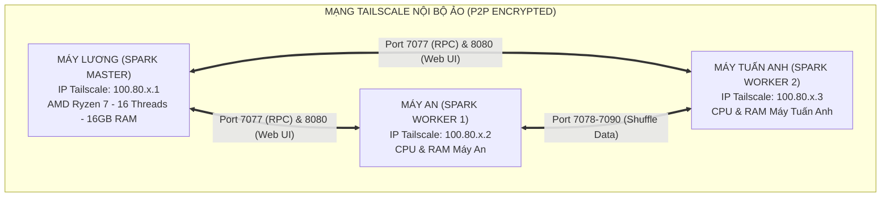

# HƯỚNG DẪN TRIỂN KHAI CỤM APACHE SPARK PHÂN TÁN TRÊN 3 LAPTOP Ở NHÀ RIÊNG QUA TAILSCALE (MESH VPN)

> **Mã tài liệu:** `doc/14_HUONG_DAN_TRIEN_KHAI_SPARK_CLUSTER_3_LAPTOP_TAILSCALE.md`  
> **Áp dụng cho:** Nhóm 6 – Học phần Nhập môn Big Data (HK VII)  
> **Thành viên:** Lê Đức Lương (Lead), Cù Văn Vĩ An, Trần Huỳnh Tuấn Anh  
> **Mục tiêu:** Nối 3 laptop vật lý ở 3 mạng WiFi gia đình khác nhau thành một Cụm tính toán Apache Spark Standalone phân tán thực thụ để huấn luyện mô hình và chụp minh chứng cho Báo cáo Chương 4 & 5.

---

## 1. TỔNG QUAN KIẾN TRÚC MẠNG NỘI BỘ ẢO (TAILSCALE MESH VPN)

Khi làm việc tại nhà riêng, router WiFi gia đình cấp cho mỗi laptop một IP mạng cục bộ dạng `192.168.1.x` hoặc `192.168.0.x`. Ba mạng này hoàn toàn độc lập và bị chặn bởi tường lửa NAT của nhà mạng Internet (FPT, Viettel, VNPT).

**Giải pháp:** Sử dụng **Tailscale** (công nghệ Mesh VPN dựa trên giao thức WireGuard P2P). Tailscale sẽ cấp cho mỗi máy một địa chỉ IP nội bộ ảo cố định dạng `100.x.y.z`, cho phép 3 máy ping và trao đổi dữ liệu trực tiếp với độ trễ thấp và mã hóa đầu cuối (End-to-End Encryption).



---

## 2. BƯỚC 1: THIẾT LẬP TÀI KHOẢN VÀ CÀI ĐẶT TAILSCALE

### 1. Thống nhất tài khoản nhóm
* Một thành viên đại diện tạo hoặc dùng chung **1 tài khoản Google/GitHub của nhóm** (ví dụ tài khoản dùng chung cho đồ án hoặc repo Git).
* Truy cập trang chủ: [https://tailscale.com](https://tailscale.com) $\to$ Chọn **Sign in** bằng tài khoản chung này.

### 2. Cài đặt trên cả 3 máy tính (Lương, An, Tuấn Anh)
1. Tải bản cài đặt Windows: [https://tailscale.com/download/windows](https://tailscale.com/download/windows).
2. Tiến hành cài đặt theo mặc định (Next $\to$ Install $\to$ Finish).
3. Sau khi cài xong, nhìn xuống góc dưới bên phải màn hình (khay Taskbar cạnh đồng hồ), nhấp chuột phải vào biểu tượng **Tailscale** $\to$ Chọn **Log in...**.
4. Trình duyệt mở ra $\to$ Đăng nhập bằng **chính tài khoản chung** của nhóm.
5. Sau khi đăng nhập thành công, Tailscale sẽ cấp cho máy một địa chỉ IP ảo cố định dạng `100.x.y.z`.

### 3. Ghi lại bảng phân bổ IP Tailscale của nhóm:
*(Mỗi bạn mở bảng điều khiển Tailscale và ghi nhận IP của mình vào nhóm Zalo)*:

| Thành viên | Vai trò trong cụm Spark | Địa chỉ IP Tailscale (Ví dụ) | Cổng lắng nghe (Ports) |
| :--- | :--- | :---: | :--- |
| **Lê Đức Lương** | **Spark Master** (+ Tùy chọn Worker 0) | `100.80.1.10` | `7077` (Master), `8080` (Web UI), `4040` (Job UI) |
| **Cù Văn Vĩ An** | **Spark Worker 1** | `100.80.1.20` | `8081` (Worker Web UI), `7078-7090` (BlockManager) |
| **Trần Huỳnh Tuấn Anh** | **Spark Worker 2** | `100.80.1.30` | `8081` (Worker Web UI), `7078-7090` (BlockManager) |

---

## 3. BƯỚC 2: MỞ TƯỜNG LỬA WINDOWS DEFENDER FIREWALL (BẮT BUỘC)

Mặc định Windows 11 sẽ chặn các gói tin Ping (ICMP) và chặn các kết nối mạng từ xa đến các cổng của Apache Spark. Cả 3 bạn cần mở tường lửa như sau:

Mỗi bạn mở **PowerShell với quyền Administrator** (Click chuột phải vào Start menu $\to$ chọn *Terminal (Admin)* hoặc *PowerShell (Admin)*) và chạy 2 lệnh sau:

### Lệnh 1: Cho phép máy khác Ping kiểm tra kết nối tới mình
```powershell
netsh advfirewall firewall add rule name="Allow ICMPv4-In (Ping)" protocol=icmpv4:any,any dir=in action=allow
```

### Lệnh 2: Mở toàn bộ các dải cổng của Apache Spark
```powershell
netsh advfirewall firewall add rule name="Spark Cluster Ports" dir=in action=allow protocol=TCP localport=4040,7077,7078-7090,8080,8081
```

---

## 4. BƯỚC 3: KIỂM TRA PING THÔNG MẠNG GIỮA 3 NHÀ

Sau khi đã bật Tailscale và mở tường lửa:
* **Tại máy của An:** Mở PowerShell gõ:
  ```powershell
  ping 100.80.1.10
  ```
  *(Thay `100.80.1.10` bằng IP Tailscale thật của máy Lương)*.
  * **Kết quả đạt chuẩn:** Xuất hiện các dòng:
    `Reply from 100.80.1.10: bytes=32 time=15ms TTL=128`
* **Tại máy của Tuấn Anh:** Ping kiểm tra sang cả Lương và An.
* Khi cả 3 máy ping qua lại đều có `Reply` và thời gian phản hồi `< 30ms`, mạng ảo đã sẵn sàng 100%.

---

## 5. BƯỚC 4: CẤU HÌNH BIẾN MÔI TRƯỜNG SPARK (CẠM BẪY SỐ 1)

> [!CAUTION]
> **LƯU Ý CỐT TỬ:**  
> Nếu không đặt biến `SPARK_LOCAL_IP`, Apache Spark sẽ tự động dùng IP WiFi gia đình (`192.168.1.x`). Khi đó máy An kết nối được tới Lương, nhưng máy Lương sẽ không thể gửi dữ liệu ngược lại cho máy An vì mạng của Lương không biết `192.168.1.x` của nhà An là ai. Cụm sẽ lập tức bị lỗi `Connection refused` hoặc `BlockManager timeout`.

**Khắc phục:** Trước khi khởi động bất kỳ tiến trình Spark nào, từng bạn phải gán biến môi trường `SPARK_LOCAL_IP` bằng IP Tailscale của chính mình:

* **Trên máy Lương:**
  ```powershell
  $env:SPARK_LOCAL_IP = "100.80.1.10"
  ```
* **Trên máy An:**
  ```powershell
  $env:SPARK_LOCAL_IP = "100.80.1.20"
  ```
* **Trên máy Tuấn Anh:**
  ```powershell
  $env:SPARK_LOCAL_IP = "100.80.1.30"
  ```

---

## 6. BƯỚC 5: KHỞI ĐỘNG CỤM PHÂN TÁN (START CLUSTER)

### 6.1. Tại máy của LƯƠNG (Bật Spark Master)
Trong thư mục gốc dự án hoặc thư mục cài đặt Spark, mở PowerShell và chạy:

```powershell
# Gán IP Tailscale
$env:SPARK_LOCAL_IP = "100.80.1.10"

# Khởi chạy tiến trình Master
spark-class org.apache.spark.deploy.master.Master -h 100.80.1.10 -p 7077 --webui-port 8080
```

* **Kiểm tra:**
  * Mở trình duyệt Web trên máy Lương: `http://localhost:8080` (hoặc `http://100.80.1.10:8080`).
  * Giao diện **Spark Master at spark://100.80.1.10:7077** sẽ xuất hiện.
  * Đồng thời, bạn An và bạn Tuấn Anh ở nhà riêng cũng mở trình duyệt và gõ `http://100.80.1.10:8080` $\to$ **Nếu xem được giao diện Master của Lương là đã thành công kết nối!**

---

### 6.2. Tại máy của AN (Gia nhập làm Worker 1)
Bạn An mở PowerShell trên máy mình và chạy:

```powershell
# Gán IP Tailscale của máy An
$env:SPARK_LOCAL_IP = "100.80.1.20"

# Kết nối vào Master của Lương
spark-class org.apache.spark.deploy.worker.Worker spark://100.80.1.10:7077 -h 100.80.1.20 --webui-port 8081
```

---

### 6.3. Tại máy của TUẤN ANH (Gia nhập làm Worker 2)
Bạn Tuấn Anh mở PowerShell trên máy mình và chạy:

```powershell
# Gán IP Tailscale của máy Tuấn Anh
$env:SPARK_LOCAL_IP = "100.80.1.30"

# Kết nối vào Master của Lương
spark-class org.apache.spark.deploy.worker.Worker spark://100.80.1.10:7077 -h 100.80.1.30 --webui-port 8081
```

---

### 6.4. Xác nhận Cụm 3 Node trên giao diện Web UI
Sau khi An và Tuấn Anh chạy lệnh, nhìn lại màn hình Web UI `http://100.80.1.10:8080` của Lương:
* Mục **Workers** sẽ lập tức hiện 2 dòng:
  * `worker-...-100.80.1.20:xxxx` (Trạng thái: **ALIVE**, Cores: máy An, RAM: máy An)
  * `worker-...-100.80.1.30:xxxx` (Trạng thái: **ALIVE**, Cores: máy Tuấn Anh, RAM: máy Tuấn Anh)
* Tổng tài nguyên của cụm lúc này là sự cộng gộp sức mạnh CPU và RAM của các máy!

*(Nếu Lương muốn máy mình cũng tham gia làm Worker tính toán, mở thêm 1 tab terminal khác trên máy Lương và gõ: `spark-class org.apache.spark.deploy.worker.Worker spark://100.80.1.10:7077 -h 100.80.1.10 --webui-port 8082` $\to$ Cụm sẽ có đủ 3 Workers!)*

---

## 7. BƯỚC 6: ĐỒNG BỘ DỮ LIỆU ĐỂ TRÁNH NGHẼN BĂNG THÔNG INTERNET

Tệp dữ liệu sạch sau khi tiền xử lý là:
[`Flight Delay Dataset — 2024/cleaned_flight_data_2024.parquet`](file:///c:/LeDucLuong/HK%20VII/NhapMonBigData/DoAn/Flight%20Delay%20Dataset%20%E2%80%94%202024/cleaned_flight_data_2024.parquet) có kích thước rất nhỏ gọn: **228.39 MB**.

> [!TIP]
> **NGUYÊN TẮC BIG DATA "DATA LOCALITY":**  
> Không nên để Master truyền 228MB qua mạng internet cho các Worker mỗi lần chạy Job. Hãy để cả 3 bạn có sẵn thư mục Parquet này trên ổ đĩa SSD cục bộ tại cùng một đường dẫn tương đối trong project Git:  
> `Flight Delay Dataset — 2024/cleaned_flight_data_2024.parquet/`  
> Khi đó:
> 1. Mỗi Worker đọc dữ liệu từ SSD của chính mình với tốc độ cực cao (> 3,000 MB/s).
> 2. Mạng Tailscale chỉ dùng để truyền các lệnh điều phối công việc và các thông số cây quyết định (chỉ vài chục KB), không bao giờ bị nghẽn mạng!

---

## 8. BƯỚC 7: THỰC THI HUẤN LUYỆN SPARK MLLIB TRÊN CỤM (SUBMIT JOB)

Tại máy của Lương (hoặc bất kỳ máy nào trong nhóm), viết một script Python kết nối tới Master `spark://100.80.1.10:7077`:

```python
import os
import sys
from pyspark.sql import SparkSession
from pyspark.ml.classification import RandomForestClassifier
from pyspark.ml.evaluation import MulticlassClassificationEvaluator

# Bắt buộc đặt IP Driver là IP Tailscale của máy phát lệnh
os.environ["SPARK_LOCAL_IP"] = "100.80.1.10"

# Khởi tạo Spark Session trỏ tới Master 3 máy
spark = SparkSession.builder \
    .appName("FlightDelay_3Node_Cluster_7M") \
    .master("spark://100.80.1.10:7077") \
    .config("spark.driver.host", "100.80.1.10") \
    .config("spark.driver.bindAddress", "100.80.1.10") \
    .config("spark.executor.memory", "3g") \
    .config("spark.executor.cores", "4") \
    .getOrCreate()

print(">>> [SUCCESS] Da ket noi thanh cong vao Cum Spark 3 Node!")
print(f">>> Spark Master Web UI: {spark.sparkContext.uiWebUrl}")

# Đọc dữ liệu Parquet phân vùng
data_path = "Flight Delay Dataset — 2024/cleaned_flight_data_2024.parquet"
df = spark.read.parquet(data_path)
print(f">>> Tong so dong du lieu: {df.count():,}")

# Các bước huấn luyện Spark MLlib tiếp theo...
```

---

## 9. HƯỚNG DẪN THU THẬP MINH CHỨNG CHO BÁO CÁO ĐỒ ÁN (CHƯƠNG 4 & 5)

Khi cụm đang chạy, các bạn cần chụp 4 bức ảnh đắt giá nhất để đưa vào file báo cáo Word và slide thuyết trình:

1. **Ảnh 1 - Cụm đa máy vật lý:** Chụp trang chủ Spark Web UI (`http://100.80.1.10:8080`) thấy rõ danh sách các Workers mang 3 địa chỉ IP Tailscale khác nhau (`100.80.x.10`, `100.80.x.20`, `100.80.x.30`), tổng Cores và RAM cộng dồn.
2. **Ảnh 2 - Spark Application DAG:** Mở tab **Jobs** $\to$ click vào Job đang chạy để chụp sơ đồ Directed Acyclic Graph (DAG) phân rã thành các Stages.
3. **Ảnh 3 - Phân bổ Tasks (Event Timeline):** Chụp biểu đồ Event Timeline thể hiện các tác vụ (Tasks) được chia đều đồng thời cho các Executor ở cả 3 máy tính.
4. **Ảnh 4 - Màn hình Tailscale Admin Console:** Chụp danh sách 3 thiết bị Laptop của 3 thành viên đang ở trạng thái **Connected**.

Bộ minh chứng này sẽ khẳng định 100% đồ án của nhóm là **Hệ thống Dữ liệu lớn phân tán thực thụ**, đáp ứng chuẩn mực cao nhất của học phần Big Data!
